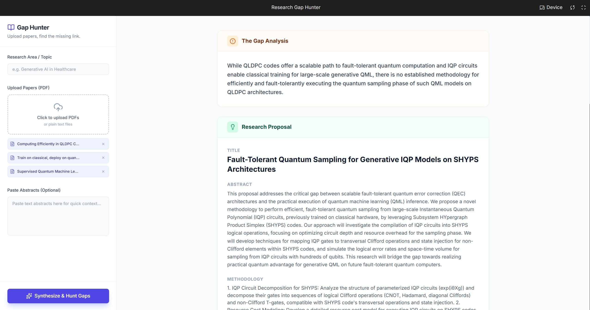
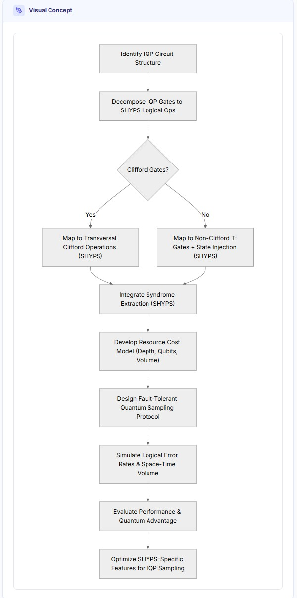

# 🔍 Research Gap Hunter



A tool that helps researchers analyze academic papers and identify unexplored areas, conflicting findings, and limitations—making it easier to find your next thesis topic or research project.

## 📊 Visual Methodology Generation
The tool uses Gemini 2.0 Flash to analyze methodology gaps and automatically generates a corresponding Mermaid.js flowchart.



## 🚀 Features
- **Automated Analysis:** Processes PDF or text-based research papers
- **Cross-Reference Analysis:** Uses Gemini 2.0 Flash to identify patterns and gaps across multiple papers
- **Visual Methodology:** Automatically generates Mermaid.js flowcharts to visualize proposed research paths
- **Type-Safe Implementation:** Built with TypeScript for robust data handling

## 🛠️ Technical Stack
- **Frontend:** React 19, TypeScript
- **AI Integration:** Google Generative AI (Gemini API)
- **Styling:** Tailwind CSS, Lucide React (Icons)
- **Visualization:** Mermaid.js

## 📦 Installation

```bash
# Clone the repository
git clone https://github.com/BoonHow97/research-gap-hunter.git
cd research-gap-hunter

# Install dependencies
npm install

# Set up environment variables
cp .env.example .env
# Add your Gemini API key to .env

# Start development server
npm start
```

## 💡 How to Use

1. Upload one or more research papers (PDF or text format)
2. Click "Analyze" to process the papers
3. Review identified gaps in the results panel
4. Explore the generated methodology flowchart
5. Export findings for your research proposal

## 🏗️ Project Structure

```
├── public/
│   └── index.html         # Application entry point
├── src/
│   ├── components/        # UI components (Sidebar, ResultsView)
│   ├── services/          # API integration logic
│   ├── types/             # TypeScript interfaces and definitions
│   ├── App.tsx            # Root application component
│   └── index.tsx          # React DOM mounting logic
├── .gitignore             # Git exclusion rules
├── package.json           # Dependencies and scripts
└── README.md              # Project documentation
```

## 🗺️ Roadmap

- [ ] Support for additional AI models (Claude, GPT-4)
- [ ] Export to LaTeX format
- [ ] Collaborative gap analysis features
- [ ] Citation network visualization

## 🤝 Contributing

Contributions are welcome! Feel free to open an issue or submit a pull request.

## 📄 License

MIT License - see LICENSE file for details

## 📧 Contact

For questions or feedback, please open an issue on GitHub.